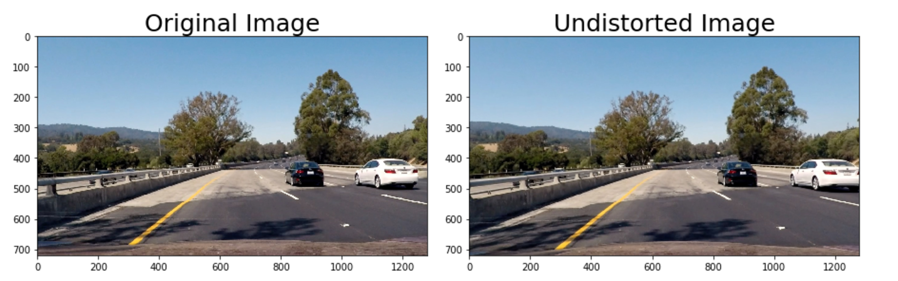
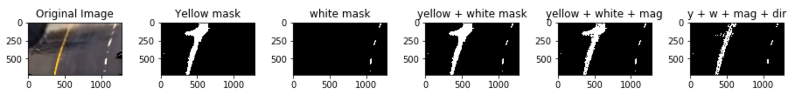
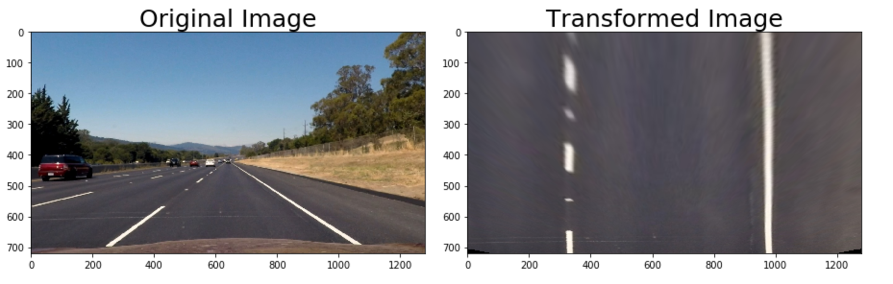
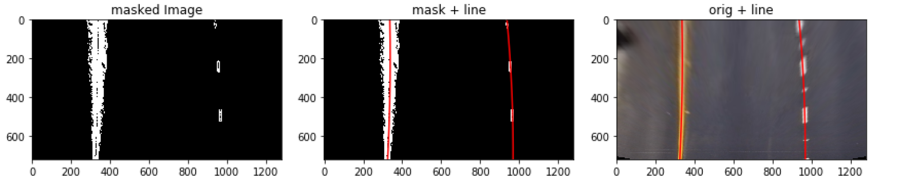
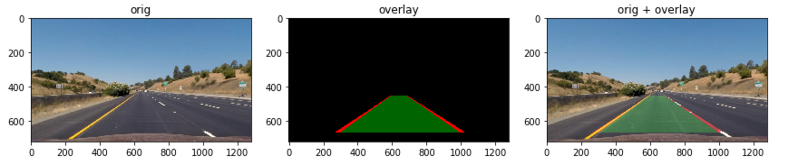
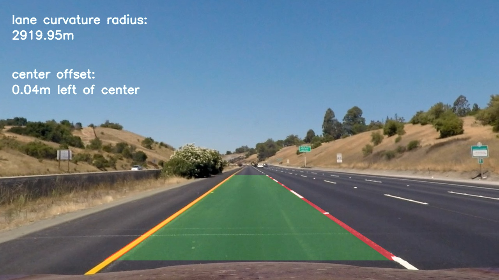

**Advanced Lane Finding Project**

The goals / steps of this project are the following:

* Compute the camera calibration matrix and distortion coefficients given a set of chessboard images.
* Apply a distortion correction to raw images.
* Use color transforms, gradients, etc., to create a thresholded binary image.
* Apply a perspective transform to rectify binary image ("birds-eye view").
* Detect lane pixels and fit to find the lane boundary.
* Determine the curvature of the lane and vehicle position with respect to center.
* Warp the detected lane boundaries back onto the original image.
* Output visual display of the lane boundaries and numerical estimation of lane curvature and vehicle position.

## [Rubric](https://review.udacity.com/#!/rubrics/571/view) Points

### Here I will consider the rubric points individually and describe how I addressed each point in my implementation.  

---

### Writeup / README

#### 1. Provide a Writeup / README that includes all the rubric points and how you addressed each one.  You can submit your writeup as markdown or pdf.  [Here](https://github.com/udacity/CarND-Advanced-Lane-Lines/blob/master/writeup_template.md) is a template writeup for this project you can use as a guide and a starting point.  

You're reading it!

### Camera Calibration

#### 1. Computed the camera matrix and distortion coefficients. Provide an example of a distortion corrected calibration image.

The code for this step is contained in the first code cell of the IPython notebook located in `./lane_lines.ipynb` - using a `Calibrator` object found in `src/calibrator.py` 

I start by preparing "object points", which will be the (x, y, z) coordinates of the chessboard corners in the world. Here I am assuming the chessboard is fixed on the (x, y) plane at z=0, such that the object points are the same for each calibration image.  Thus, `objp` is just a replicated array of coordinates, and `objpoints` will be appended with a copy of it every time I successfully detect all chessboard corners in a test image.  `imgpoints` will be appended with the (x, y) pixel position of each of the corners in the image plane with each successful chessboard detection.  

I then used the output `objpoints` and `imgpoints` to compute the camera calibration and distortion coefficients using the `cv2.calibrateCamera()` function.  I applied this distortion correction to the test image using the `cv2.undistort()` function and obtained this result: 

### Pipeline (single images)

#### 1. Distortion Correction.

To demonstrate this step, I will describe how I apply the distortion correction to one of the test images like this one:

This is done with a `Calibrator` that stores the necessary information generated from calibration from chessboard images.

Examples on all the test images can be found in `output_images/*_calibrated.jpg`

#### 2. Thresholding

**NB: I chose to do my thresholding step _after_ the transformation step **

I used a combination of color and gradient thresholds to generate a binary image. At a high level the goal was to do two things.

1.  Isolate yellow and white colours.
2.  Identify which of these are likely to be lines.

The first was done by combining two separate color filters (white and yellow) by converting to HSV and using openCVs `inrange` to create a mask.

The second used a combination of gradient magnitude and direction to try to filter out all the areas that were not pointing in what we considered the right direction or did not have a strong enough change in gradient.

The process is illustrated below and the code can be found in the `lane_mask` method in `src/lane_finder.py`. Examples on all the test images can be found in `output_images/*_masked.jpg`

This step (as well as all the other individual steps can be seen in `./lane_lines.ipynb`)

#### 3. Transformation

This is performed by a `Transformer` object from `src.lane_warp.py`.

`Transformer` has both `transform` and `inverse_transform` methods to go between warped and unwarped images.

Examples on all the test images can be found in `output_images/*_transformed.jpg`

The four source and destination points needed for openCV's `warpPerspective` function were chosen by hand to roughly capture as much road as possible. The "bird's eye" was verified by attempting to get the "straight" road images to be parallel in the warped view, an illustration below.

#### 4. Fit a polynomial to lane pixels

Finding the line equations for a given masked image is done in the `line_equations` `src/lane_finder`. Given a masked image it returns a tuple of the equations (coefficient vectors) of (what it believes to be) the left and right lines.

This is done (with liberal use of code provided in the Udacity course materials) by first taking a histogram of the bottom half of the image, using the spikes to the left and right of center as starting points. Then sliding a window up a section at a time moving left to right with a margin to find an area with enough white pixels. These are then fit with `numpy`'s `polyfit`.

The illustration below shows the equations plotted on the masked image - and then as a sanity check, on the original (warped) image.

Examples on all the test images can be found in `output_images/*_lines.jpg` where the equations have been drawn in blue lines, a green fill between them (where the green overlaps with white of previous step it produces red, but only in these test images, a different approach is taken to overlaying in the final pipeline)

#### 5. Lane curvature / Vehicle position

To calculate curvature we simply implemented the following formula. An explanation of which can be found [here](http://www.intmath.com/applications-differentiation/8-radius-curvature.php). The only caveat is that we apply a scaling factor since we move from pixel values to meter values.

The center offset is calculated by measuring the difference between the midpoint between two starting points of the equations and the midpoint of the image. (Given the camera is mounted in the middle of the car - we assume the center of the image corresponds to the centre of the car.)

The implementations can be found in `src/lane_measurements.py` the `curvature` and `center_offset` methods respectively. Examples on the test images can be seen in `lane_lines.ipynb`.

#### 6. Overlay

To create the overlay I used `cv2.polylines`, `cv2.putText` and `cv2.fillPoly` to draw based on the initial image and the line equations. The lane overlay is created with `lane_overlay` in `src/overlay.py`. Since this is based on the transformed image, we apply the `Transformer`'s `inverse_transform`, then apply to the original undistorted image

The curvature and offset overlay are generated in `lane_measurements_overlay`.

An example of the final combined result.

Examples on all the test images can be found in `output_images/*_processed.jpg` ... and of course every frame of the output video 😁.

---

### Pipeline (video)

#### 1. Final video.

Here's a [link to my video result](./project_video_output.mp4)

---

### Discussion

#### 1. Briefly discuss any problems / issues you faced in your implementation of this project.  Where will your pipeline likely fail?  What could you do to make it more robust?

While this particular pipeline worked quite well on the project video, there were many shortcomings.

The most glaring one is that every frame is processed from scratch to find the lane lines. No information which may be useful to find lane lines (for example last frame's equations, moving averages etc.) are used. This means we have less information and less room for error. With the current setup the pipeline must be robust enough to understand every frame from scratch, whereas keeping a moving average would allow us to drop frames (keep previous values) if we were not confident enough with our detection. It would also make the process much faster, since we could narrow our line search to an area within a given margin of the previous lines.

Going on the challenge video - unsurprising pain points were still low light conditions. The project video is very well lit for the most part. One potential solution to this would be to make the thresholding more dynamic - for example to increase sensitivity in darker or lower contrast frames.

Another failure point for the current model is when we have frames with white markings in between the lanes. When we search for our histogram peaks when looking for a starting point to search upwards from, we could choose a peak created by some of these road markings instead. This could be done by masking some of the region in the center of the image (with care not to go to far 'up' in case we obscure some of the lane lines in the distance).

These are just a few shortcomings / suggestions for improvements. There are so many variables and cases to consider, so I tried to touch upon those with the biggest impact/effort ratio.
